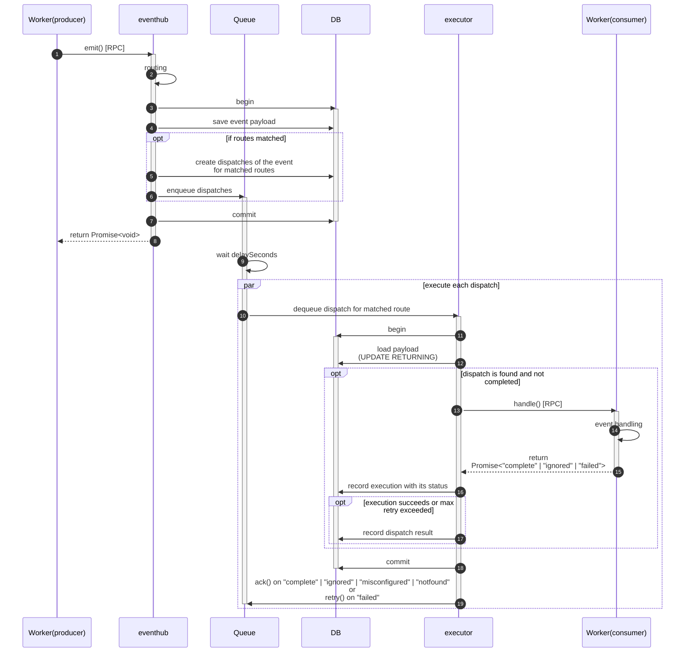

# cf-eventhub

Developing message hub that works with Cloudflare Workers and Queues with following functionalities.

- Configure destinations of each message in IaC(currently, we will support Pulumi)
- Record execution info including lost job(**Cloudflare Queues is Beta**)

## Designs
### Sequence



## To run demo
1. Launch demo workers
    ```shell
    $ pnpm dev
    ```
2. Open `http://localhost:3011` in your browser
