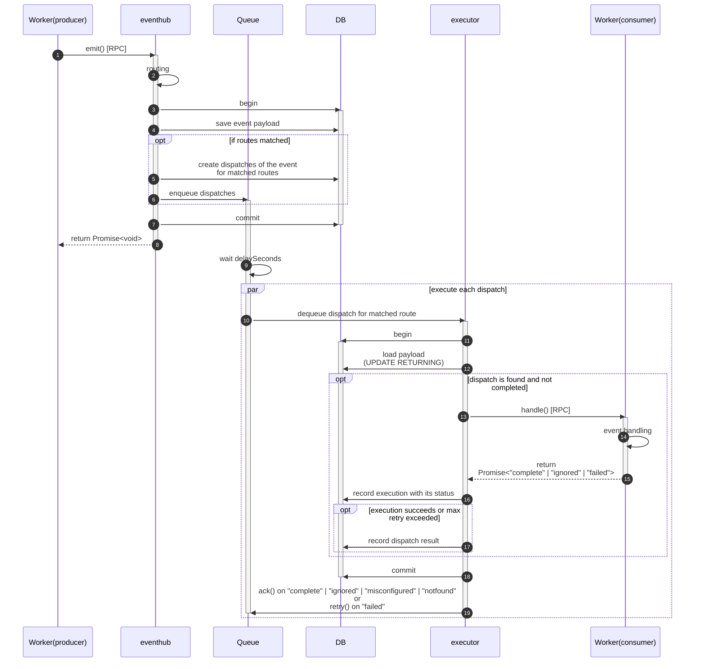

# cf-eventhub

Developing message hub that works with Cloudflare Workers and Queues with following functionalities.

- Configure destinations of each message in IaC(currently, we will support Pulumi)
- Record execution info including lost job(**Cloudflare Queues is Beta**)

## Designs
### Delivery semantics

`cf-eventhub-v1` provides `at-least-once` delivery semantics, not `exactly-once`.
It prioritizes avoiding message loss over preventing duplicate deliveries, so the
same event may be delivered more than once in rare cases such as retry recovery
or overlap between initial delivery and alarm-based retry.

Consumers must therefore be idempotent. Each delivered payload should contain a
stable unique event ID, and downstream systems are expected to deduplicate or
safely ignore repeated deliveries based on that ID.

Delivery jobs keep a terminal result as `final_status` (`completed` or `failed`)
plus its timestamp in `finalized_at`. This terminal state is exclusive by
design: a job cannot be both completed and failed at the same time.

If an initial delivery attempt and an alarm-driven retry overlap, duplicate
delivery attempts may still occur. However, the persisted final result remains
consistent. A later successful delivery wins over an earlier terminal failure,
and a late failure is ignored once a job has already been finalized as
`completed`.

`EVENTHUB_INITIAL_RETRY_DELAY_MS` should be configured long enough to cover
normal initial delivery latency, reducing the chance that alarm-based retry
overlaps with an in-flight first attempt. If a job reaches `final_status =
'failed'`, it is no longer retried automatically and must be handled through
operational monitoring and manual or automated recovery procedures.

### Sequence


```mermaid
sequenceDiagram
  participant Worker1 as Worker(producer)
  participant eventhub as eventhub
  participant Queue as Queue
  participant DB
  participant executor as executor
  participant Worker2 as Worker(consumer)

  autonumber
  Worker1 ->> eventhub: emit() [RPC]
  activate eventhub
  eventhub ->> eventhub: routing
  eventhub ->> DB: begin
  activate DB
  eventhub ->> DB: save event payload
  opt if routes matched
    eventhub ->> DB: create dispatches of the event<br>for matched routes
    eventhub ->> Queue: enqueue dispatches
    activate Queue
  end
  eventhub ->> DB: commit
  deactivate DB
  eventhub -->> Worker1: return Promise<void>
  deactivate eventhub

  Queue ->> Queue: wait delaySeconds

  par execute each dispatch
    Queue ->> executor: dequeue dispatch for matched route
    activate executor
    executor ->> DB: begin
    activate DB
    executor ->> DB: load payload<br>(UPDATE RETURNING)
    opt dispatch is found and not completed
      executor ->> Worker2: handle() [RPC]
      activate Worker2
      Worker2 ->> Worker2: event handling
      Worker2 -->> executor: return<br>Promise<"complete" | "ignored" | "failed">
      deactivate Worker2
      executor ->> DB: record execution with its status
      opt execution succeeds or max retry exceeded
        executor ->> DB: record dispatch result
      end
    end
    executor ->> DB: commit
    deactivate DB

    executor ->> Queue: ack() on "complete" | "ignored" | "misconfigured" | "notfound"<br>or<br>retry() on "failed"
    deactivate executor
    deactivate Queue
  end
```

## To run demo
1. Launch demo workers
    ```shell
    $ pnpm --filter cf-eventhub --filter web-console build
    $ pnpm dev
    ```
2. Open `http://localhost:3011` in your browser
