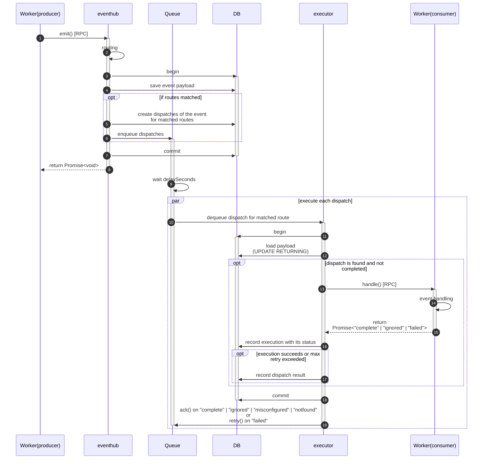

# cf-eventhub

Developing message hub that works with Cloudflare Workers and Queues with following functionalities.

- Configure destinations of each message in IaC(currently, we will support Pulumi)
- Record execution info including lost job(**Cloudflare Queues is Beta**)

## Designs
### Sequence


```mermaid
sequenceDiagram
  participant Worker1 as Worker(producer)
  participant eventhub as eventhub
  participant Queue as Queue
  participant DB
  participant executor as executor
  participant Worker2 as Worker(consumer)

  autonumber
  Worker1 ->> eventhub: emit() [RPC]
  activate eventhub
  eventhub ->> eventhub: routing
  eventhub ->> DB: begin
  activate DB
  eventhub ->> DB: save event payload
  opt if routes matched
    eventhub ->> DB: create dispatches of the event<br>for matched routes
    eventhub ->> Queue: enqueue dispatches
    activate Queue
  end
  eventhub ->> DB: commit
  deactivate DB
  eventhub -->> Worker1: return Promise<void>
  deactivate eventhub

  Queue ->> Queue: wait delaySeconds

  par execute each dispatch
    Queue ->> executor: dequeue dispatch for matched route
    activate executor
    executor ->> DB: begin
    activate DB
    executor ->> DB: load payload<br>(UPDATE RETURNING)
    opt dispatch is found and not completed
      executor ->> Worker2: handle() [RPC]
      activate Worker2
      Worker2 ->> Worker2: event handling
      Worker2 -->> executor: return<br>Promise<"complete" | "ignored" | "failed">
      deactivate Worker2
      executor ->> DB: record execution with its status
      opt execution succeeds or max retry exceeded
        executor ->> DB: record dispatch result
      end
    end
    executor ->> DB: commit
    deactivate DB

    executor ->> Queue: ack() on "complete" | "ignored" | "misconfigured" | "notfound"<br>or<br>retry() on "failed"
    deactivate executor
    deactivate Queue
  end
```

### Fast path

Set `EVENTHUB_FAST_PATH_URL` and `EVENTHUB_FAST_PATH_SECRET` on both eventhub
and executor workers to start zero-delay dispatches via signed HTTP before the
Queue consumer receives them. Queue messages are still enqueued as fallback.

- The eventhub sends `POST /__cf_eventhub/fast-path` with an HMAC-SHA256
  signature.
- The executor verifies the signature and calls the same dispatcher used by the
  Queue consumer.
- Only dispatches with `delaySeconds: 0` use the fast path.
- If the fast path fails, the Queue message is retried using the configured
  retry delay.

## To run demo
1. Launch demo workers
    ```shell
    $ pnpm --filter cf-eventhub --filter web-console build
    $ pnpm dev
    ```
2. Open `http://localhost:3011` in your browser
