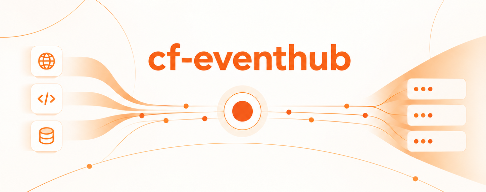

# cf-eventhub

This monorepo provides event ingestion, durable delivery, and operational tooling
for Cloudflare Workers. Events are persisted in Durable Objects before they are
routed to Cloudflare Queues or R2, making delivery history, retries, failure
investigation, and redrive available as one system.

## Packages

| Package | Role |
| --- | --- |
| [`cf-eventhub`](./cf-eventhub/README.md) | Durable Object component for persistence, fan-out routing, Queue/R2 delivery, retries, redrive, Registry discovery, and retention or archival. |
| [`@cf-eventhub/web-console`](./web-console/README.md) | Operations UI for selecting EventHub instances, inspecting payloads and delivery jobs, creating events, and redriving deliveries. |
| [`eventhub-demo`](./demo/src/index.ts) | Local example that connects EventHub, the Registry, Web Console, Queues, an R2 sink, and DLQ failure reporting. |

## Why this repo

- **Persist before delivery**: retain the event and every delivery job before the
  first delivery attempt starts.
- **Fan out by content**: route one JSON event to multiple Queue and R2 bindings
  with declarative conditions or custom routing logic.
- **Recover from failures**: retry transient delivery errors automatically,
  record downstream failures from a DLQ, and redrive individual deliveries.
- **Operate over time**: discover named EventHub instances, inspect them in the
  Web Console, and delete or archive finalized events using retention policies.

## Quick start

```sh
corepack enable
pnpm install
pnpm dev
```

This starts the local demo with Wrangler. Open the URL printed by Wrangler, then
visit `/setup` once to register the example EventHub instances. The repository
uses Node.js 24 and pnpm 11, as declared in `package.json`.

For installation, Durable Object bindings and migrations, API details, and
deployment examples, see the [`cf-eventhub`](./cf-eventhub/README.md) and
[`@cf-eventhub/web-console`](./web-console/README.md) package documentation.
