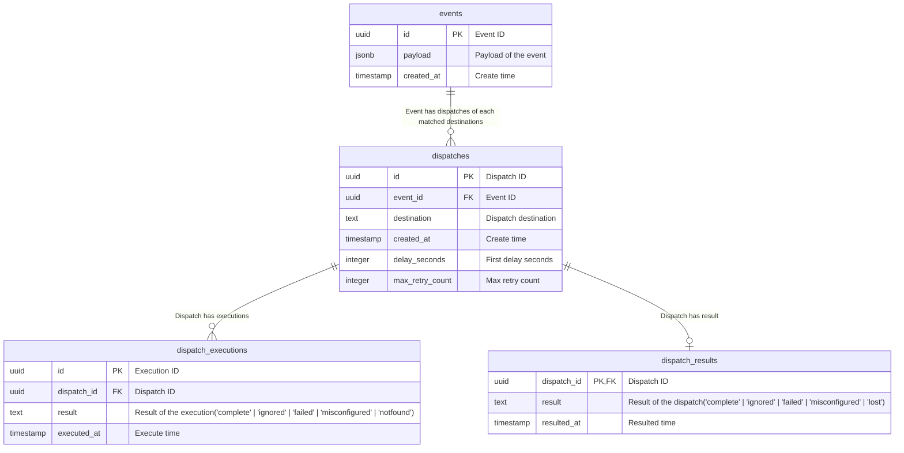

# Postgres schema

```mermaid
erDiagram
    events {
        uuid id PK "Event ID"
        jsonb payload "Payload of the event"
        timestamp created_at "Create time"
    }

    dispatches {
        uuid id PK "Dispatch ID"
        uuid event_id FK "Event ID"
        text destination "Dispatch destination"
        timestamp created_at "Create time"
        integer delay_seconds "First delay seconds"
        integer max_retry_count "Max retry count"
    }
    events ||--o{ dispatches: "Event has dispatches of each matched destinations"

    dispatch_executions {
        uuid id PK "Execution ID"
        uuid dispatch_id FK "Dispatch ID"
        text result "Result of the execution('complete' | 'ignored' | 'failed' | 'misconfigured' | 'notfound')"
        timestamp executed_at "Execute time"
    }
    dispatches ||--o{ dispatch_executions: "Dispatch has executions"

    dispatch_results {
        uuid dispatch_id PK, FK "Dispatch ID"
        text result "Result of the dispatch('complete' | 'ignored' | 'failed' | 'misconfigured' | 'lost')"
        timestamp resulted_at "Resulted time"
    }
    dispatches ||--o| dispatch_results: "Dispatch has result"
```
